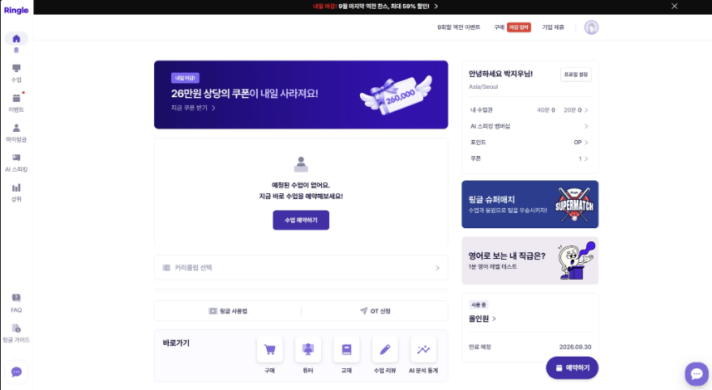
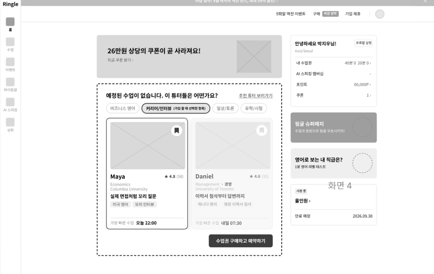

# 요구사항 정의서 (화면2_홈 페이지)

## 1. 사용자 요구사항

"사용자는 [무엇]을 달성하기 위해 [무엇]을 하고 싶다" 형식.

| 사용자 그룹 | 달성하려는 것 |
| --- | --- |
| [ 사용자] | [ 홈 화면에 진입하자마자, 나에게 적합한 튜터를 바로 추천받고 싶다.] |

## 2. 기능적 요구사항

| 요구사항 | 확인 방법 |
| --- | --- |
| 시스템은 [사용자가 회원가입 때 입력한 정보를 바탕으로] [홈 화면에 추천 튜터 두명을 노출]해야 한다 | [특정 데이터, 예) 사용자가 “비즈니스”를 관심사로 선택했을 때, 홈 화면에 “비즈니스” 관심사에 적합한 대표적인 튜터 두 명이 뜨는지 확인한다 ] |
| 시스템은 사용자가 [특정 튜터를 클릭하면] [상세정보를 우측에 보여]줘야 한다(다른 화면의 상세정보 화면과 동일) | [홈 화면에 나오는 튜터 카드를 클릭하면 우즉에서 다른 화면과 동일한 상세정보 화면이 나오는지 확인한다.] |
| 시스템은 사용자가  [”추천 튜터 바로가기”버튼을 클릭했을 때][추천 튜터 화면으로 이동] 해야 한다 | [”추천 튜터 보러가기”를 클릭했을 때 화면 3(추천튜터 화면)으로 이동하는지 확인] |
| 시스템은 사용자가 [튜터 상단에 위치한 조건을 눌렀을 때] [조건에 맞는 튜터 2명을 추천] 해야 한다 | [각각의 조건을 클릭하고서, 조건과 튜터가 부합하는지 확인한다.  ] |
| 시스템은 [학습자가 튜터 프로필 카드 우측 상단의 북마크 아이콘을 클릭했을 때 ] ["찜하기 완료 및 찜한 튜터 목록 바로가기" 알림을 하단에 노출하고, 클릭 시 찜한 튜터 모아보기 영역으로 즉시 이동할 수 있게] 해야 한다. | [튜터 프로필 카드 우측 상단의 북마크 아이콘을 클릭했을 때 하단에 바로가기 알림 창이 정상적으로 노출되는지 확인하고, 해당 알림 클릭 시 찜한 튜터 모아보기 페이지로 화면이 전환되는지 확인한다. ] |
| [시스템은 [학습자가 튜터를 선택하려 할 때] [튜터 기본 정보 화면에 튜터 리뷰 개수 / 평균 별점 ]를 제공해야 한다  ] | [ [ 튜터 선택 화면에서 프로필 화면 (사진, 이름) 밑에 직관적인 아이콘으로 “별점, 리뷰 개수”가 표현된다 ]] |

